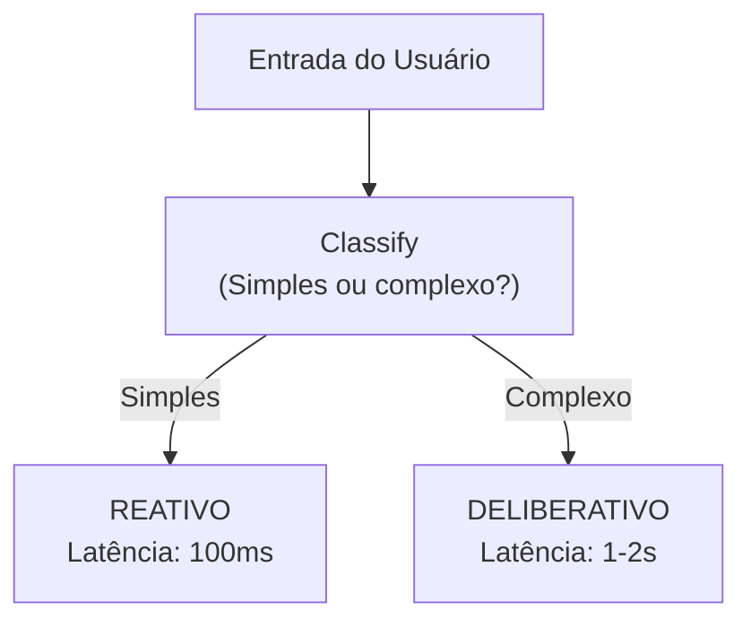

# HYBRID-FLOW: Combinando Reativo e Deliberativo em Arquiteturas de Agentes

Um agente reativo age instantaneamente. Um agente deliberativo pensa antes de agir. Qual escolher? A resposta prática é: **ambos**.

HYBRID-FLOW é uma prática emergente de combinar componentes reativos e deliberativos na mesma arquitetura.

## Reativo vs. Deliberativo

### Reativo (ReAct)

```
[Observação] → [Decisão Imediata] → [Ação]
```

**Vantagens**: Rápido, simples
**Limitações**: Falha em problemas complexos

### Deliberativo

```
[Observação] → [Planejamento] → [Plano] → [Execução]
```

**Vantagens**: Lida com complexidade
**Limitações**: Lento, overhead de planejamento

## HYBRID-FLOW: O Melhor dos Dois



### Padrão 1: Classificação + Roteamento

```python
def process(self, query):
    complexity = self.classify_complexity(query)
    
    if complexity < 0.4:
        return self.reactive_handler(query)
    elif complexity < 0.7:
        return self.hybrid_handler(query)
    else:
        return self.deliberative_handler(query)
```

### Padrão 2: Fallback

```python
def process_with_fallback(self, query):
    try:
        result = self.reactive_call(query)
        if self.validate_result(result):
            return result
    except ReactiveLimitExceeded:
        pass
    
    # Escalar para deliberativo
    plan = self.deliberative_plan(query)
    return self.execute_plan(plan)
```

### Padrão 3: Paralelo com Votação

Executar ambos em paralelo:

```python
async def process_parallel(self, query):
    r_res = await self.reactive_handler(query)
    d_res = await self.deliberative_handler(query)
    
    if r_res.confidence > 0.95:
        return r_res
    return d_res
```

## Variantes em Produção

- **Smart Manufacturing**: LLM + SLM + regras determinísticas
- **LLM + Reinforcement Learning**: Aprender quando fazer reativo vs. deliberativo
- **Roteamento Adaptativo**: Por dificuldade, complexidade
- **ReAcTree**: Raciocínio hierárquico

## Desafios

- **Quantificação de Trade-offs**: Faltam métricas padronizadas
- **Over-Engineering**: Adicionar roteamento que não melhora resultados
- **Custos**: Rodar deliberativo como fallback pode triplicar custos

## Conclusão

HYBRID-FLOW é pragmática para sistemas reais onde maioria de queries é simples, alguns casos são complexos.

## Referências

- ReAct: Synergizing Reasoning and Acting: https://arxiv.org/abs/2210.03629
- OpenAI Function Calling: https://platform.openai.com/docs/guides/function-calling
