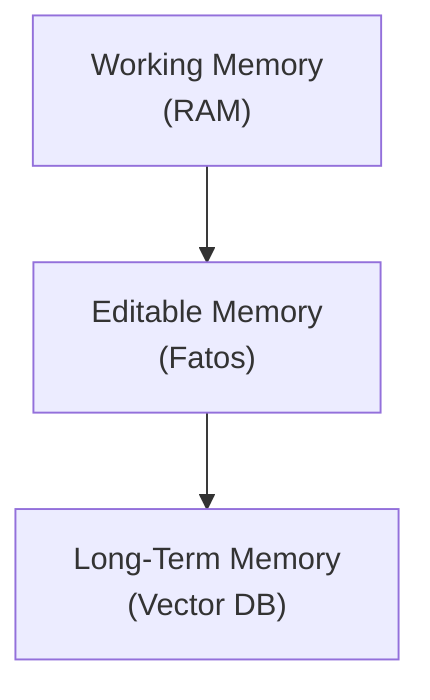
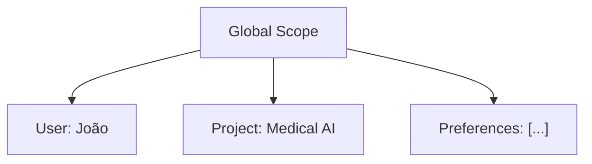

# Memória em Agentes de IA: Arquiteturas para Contexto Persistente

Um agente sem memória tem amnésia — esquece cada conversa, começa do zero. Escala para produção apenas com memória: curto prazo, longo prazo, estruturada.

## Tipos de Memória

### 1. Curto Prazo (Working Memory)

Contexto imediato da conversa:

```
User: "Qual é a capital de Portugal?"
[Memória: "User perguntou sobre capital"]
Agent: "Lisboa"
User: "Qual é a população?"
[Memória: "User perguntou sobre capital (Lisboa), agora população"]
```

### 2. Longo Prazo (Episódica)

Histórico de interações passadas:

```
Sessão anterior (10 dias):
- User discutiu projeto de IA sobre medical imaging

Sessão atual:
Agent: "Lembro que você estava trabalhando em segmentação médica..."
```

### 3. Semântica

Conhecimento factual sobre usuário:

```
Fatos:
- Nome: João
- Empresa: TechCorp
- Role: ML Engineer
```

### 4. Procedural

Aprendizado "como fazer":

```
- Quando user diz "analise", usar chain-of-thought
- Quando erro Y, recuperação Z funciona
```

## Arquiteturas

### 1. 3 Camadas (Letta / MemGPT)



### 2. Baseada em Escopo (Mem0)



### 3. Grafo de Conhecimento

Memória como entidades + relações:

```
João → desenvolve → Chatbot → usa → LLMs
```

### 4. Reflexiva

Agente pensa sobre sua memória:

```
Dia 1: "User mencionou IA"
Dia 5: "User mencionou IA novamente"
Reflexão: "User é entusiasta de IA"
```

## Frameworks (2026)

- **Mem0**: Especializado em memória
- **LangGraph Memory**: Módulos de memória para chains
- **Letta**: 3-camadas com suporte nativo

## Desafios

- **Contaminação**: Memória velha/falsa afeta decisões
- **Hallucinations**: Agente recupera fatos fabricados
- **Escalabilidade Cross-Session**: Múltiplos agentes compartilham memória
- **Atualização Stale**: Fatos que mudaram no mundo real

## Best Practices

1. Usar camadas (working + semantic + long-term)
2. Embeddings de qualidade
3. Cada fato tem source + timestamp
4. Validação antes de usar fato crítico
5. Decay: fatos antigos perdem confiança

## Conclusão

Memória é crítica para agentes em produção. Em 2026, padrão é **multicamadas**: working + semantic + structured.

## Referências

- Letta: https://www.letta.com/
- Mem0: https://mem0.ai/
- Generative Agents Paper: https://arxiv.org/abs/2304.03442
- LangGraph Memory: https://python.langchain.com/docs/modules/memory/
