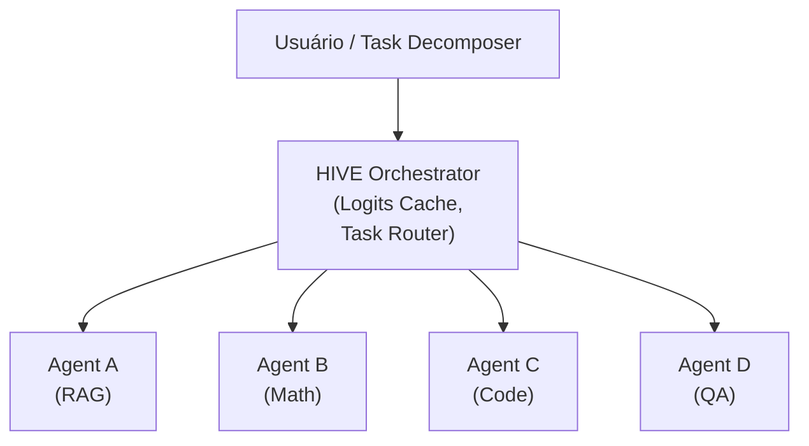

# HIVE: Infraestrutura de Escalamento para Sistemas Multi-Agente

*Escrito por Rafael Berçam Medeiros em 15 de Agosto de 2026*

Quando um agente não é suficiente, você precisa de vários agentes trabalhando juntos. Mas coordenar múltiplos LLMs é um desafio que vai muito além de "chamar várias APIs".

HIVE é uma infraestrutura emergente que resolve esse problema através de otimizações sofisticadas em tempo de inferência, alocação eficiente de recursos e eliminação de redundância entre agentes.

## O que é HIVE?

HIVE adiciona uma camada de orquestração inteligente acima de múltiplos agentes:



## Conceitos Centrais

### 1. Logits Cache: Eliminando Redundância

Quando múltiplos agentes processam o mesmo input, HIVE reutiliza cálculos intermédios:

```
Query: "Qual é a capital de Portugal?"

Agent A processa
  → Logits para "Portugal" são cacheados

Agent B processa (mesma query)
  → Reutiliza logits cacheados
  → Economia: ~30% do cálculo
```

### 2. Agent-Aware Scheduling

HIVE escolhe dinamicamente qual agente processa qual subtarefa:

```python
if task.complexity < 0.3:
    agent = SLM_Agent  # Simples
    kv_cache = "minimal"
elif task.requires_reasoning:
    agent = Large_LLM_Agent
    kv_cache = "full"
```

### 3. Test-Time Scaling

HIVE aplica algoritmos de scaling durante **tempo de inferência**:

- **Chain-of-Thought Multiplexing**: Múltiplos caminhos em paralelo
- **Iterative Refinement**: Agente 1 → Agente 2 → Agente 3
- **Beam Search Inteligente**: Explorar e descartar piores estratégias cedo

## Variantes

### 1. HIVE Multi-Agent Infrastructure (ArXiv 2604.17353)

Abordagem acadêmica com foco em eficiência computacional.

### 2. Lightweight Multi-Agent Orchestrator

Implementações open-source com padrão "Queen & Workers":

```
Queen Agent: Gerencia fluxo
    ↓
Worker Agents: Executam subtarefas
    ↓
Ledger: Histórico compartilhado
```

### 3. Beehive Pattern

Analogia com abelhas:
- **Utility Agents** (operárias): Tarefas simples
- **Super Agents** (rainhas): Supervisão
- **Scout Agents** (exploradoras): Explorar opções

## Estado Atual (2026)

- Paper recente (ArXiv 2604.17353) ganhou visibilidade
- 43K+ GitHub stars em repositórios que usam HIVE
- Integrações com LangGraph, Mem0

## Conclusão

HIVE oferece escalabilidade, eficiência e observabilidade para sistemas multi-agente. Use quando:
- Múltiplos LLMs processam queries similares
- Recursos são limitados
- Rastreabilidade é crítica

## Referências

- Hive: Multi-Agent Infrastructure (ArXiv 2604.17353): https://arxiv.org/abs/2604.17353
- aden-hive/hive GitHub: https://github.com/aden-hive/hive
- LangGraph Multi-Agent: https://github.com/langchain-ai/langgraph
